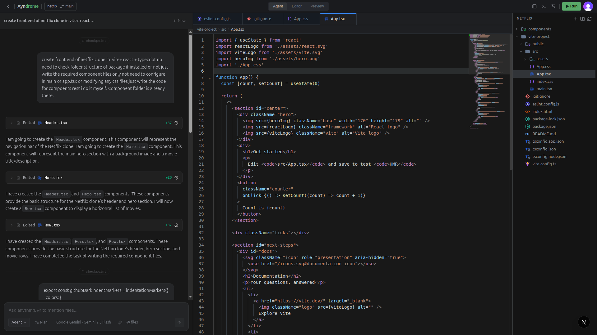

<div align="center">

<br/>


<br/>

<p>
  <a href="https://github.com/Ayndrome/Ayndrome-IDE/stargazers"></a>
  &nbsp;
  <a href="https://github.com/Ayndrome/Ayndrome-IDE/commits/main"></a>
  &nbsp;
  <a href="https://github.com/Ayndrome/Ayndrome-IDE/blob/main/LICENSE"></a>
  &nbsp;
  
</p>

<br/>

> **Write, review, and ship code — with an AI agent that reads, edits, and explains your codebase right inside the editor.**

<br/>

</div>

---

## 📸 Preview

> Screenshots and demo recordings — have some to share? Open a PR!

<!-- Add your screenshots below — drag and drop images into your PR -->
<div align="center">
  
  <!--  -->
</div>

<!--
<div align="center">
  
</div>
-->

---

## ✦ Features

<table>
<tr>
<td width="50%">

**🤖 AI Agent Loop**
Multi-step agent with full tool access — reads files, writes edits, searches code, runs terminal commands, and self-corrects on lint errors.

**📝 CodeMirror 6 Editor**
Syntax highlighting, LSP (TypeScript + Python), indentation markers, minimap, and streaming write support.

**� Diff Review UI**
Per-hunk accept/reject powered by the Myers diff algorithm. Every agent edit shows exactly which lines changed.

</td>
<td width="50%">

**🧠 Multi-Model Support**
Switch between Claude, GPT-4o, Gemini, and any OpenRouter model without leaving the editor.

**💬 Contextual Chat**
Mention files with `@filename`, collapsible tool cards, streaming responses, and checkpoint history.

**🖥️ Sandboxed Terminal**
Run shell commands inside a Docker sandbox — safe, isolated, and visible in chat.

</td>
</tr>
</table>

---

## � Tech Stack

<div align="center">
<br/>

[](https://skillicons.dev)

<br/>

| Layer     | Technology                     |
| --------- | ------------------------------ |
| Framework | Next.js 15 (App Router)        |
| Language  | TypeScript 5                   |
| Editor    | CodeMirror 6                   |
| Database  | Convex                         |
| Auth      | Clerk                          |
| State     | Zustand                        |
| AI SDK    | Vercel AI SDK                  |
| Diff      | Myers algorithm via `diff` lib |
| Styling   | Tailwind CSS + shadcn/ui       |

</div>

---

## 🚀 Getting Started

### Prerequisites

- Node.js 18+
- A [Convex](https://convex.dev) project
- API key(s) for at least one LLM provider

### 1 — Clone

```bash
git clone https://github.com/Ayndrome/Ayndrome-IDE.git
cd Ayndrome-IDE/ayndrome_ide
npm install
```

### 2 — Environment variables

Create `.env.local` in the project root:

```env
# Convex
NEXT_PUBLIC_CONVEX_URL=https://your-project.convex.cloud

# Auth (Clerk)
NEXT_PUBLIC_CLERK_PUBLISHABLE_KEY=pk_...
CLERK_SECRET_KEY=sk_...

# LLM — add whichever providers you use
ANTHROPIC_API_KEY=sk-ant-...
OPENAI_API_KEY=sk-...
GOOGLE_GENERATIVE_AI_API_KEY=...
OPENROUTER_API_KEY=sk-or-...
```

### 3 — Convex

```bash
npx convex dev
```

### 4 — Run

```bash
npm run dev
```

Open [http://localhost:3000](http://localhost:3000)

---

## � Project Structure

<details>
<summary>Click to expand</summary>

```
ayndrome_ide/
├── src/
│   ├── app/
│   │   ├── api/                     # Next.js API routes (files, auth)
│   │   ├── features/ide/
│   │   │   ├── components/          # CodeEditor, FileExplorer, TabManager
│   │   │   └── extensions/
│   │   │       ├── chat/            # ChatThreadService, ToolCard, DiffViewer
│   │   │       │   └── agent/       # diff-engine, task-tracker, workspace-state
│   │   │       └── editor/          # diff-decoration, LSP, streaming-writer
│   │   └── settings/                # Model & provider settings
│   ├── lib/
│   │   ├── model-provider/          # Model router + provider registry
│   │   └── token/                   # Token counting utilities
│   ├── server/
│   │   ├── lsp/                     # LSP manager + WebSocket server
│   │   └── sandbox/                 # Docker terminal sandbox
│   └── store/                       # Zustand: editor, diff, chat, IDE state
├── convex/                          # Schema, queries, mutations
└── server.ts                        # Express proxy for LLM API calls
```

</details>

---

## ⚙️ How the Agent Works

```
User message
     │
     ▼
ChatThreadService
  ├─ Builds workspace context (open files + token budget)
  ├─ Sends to LLM → streams response
  │
  ├─ LLM calls a tool?
  │   ├─ read_file   → reads from workspace
  │   ├─ write_file  → Myers diff → decorates editor → accept/reject UI
  │   ├─ run_terminal → executes in Docker sandbox
  │   └─ search_*   → searches files or content
  │
  └─ Loop until done or step limit reached
```

---

## � Scripts

| Command              | Description                    |
| -------------------- | ------------------------------ |
| `npm run dev`        | Next.js dev server + LLM proxy |
| `npm run dev:server` | LLM proxy only                 |
| `npm run build`      | Production build               |
| `npm run lint`       | ESLint                         |
| `npm test`           | Jest unit tests                |

---

## 🤝 Contributing

1. **Fork** the repo
2. Create a branch: `git checkout -b feat/your-feature`
3. Commit using [Conventional Commits](https://www.conventionalcommits.org):
   ```
   feat(scope): what you added
   fix(scope): what you fixed
   docs: what you documented
   ```
4. Open a **Pull Request** against `main`

All contributions welcome — from typo fixes to new features.

---

<div align="center">


**Built with ♥ by [Ayndrome](https://github.com/Ayndrome)**

</div>
